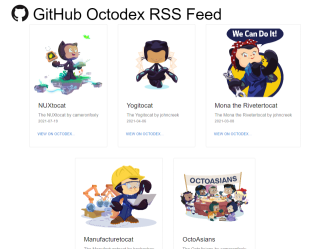

# Welcome to GitHub Universe Workshop

Congratulations on kickstarting your personal repository for `Build a web app with Codespaces and deploy it to Microsoft Azure with GitHub Actions` workshop.

In this workshop you are going to build a deploy a website to Azure using GitHub Actions, you will not need to install any software on your machine because you will be using Codespaces.

This repo has a very basic website so you don't have to start from scratch, but it has a few bugs you need to iron out before you can deploy it.

Don't worry about the Azure resources, we have granted you access to a subscription with a resource group where you can deploy your website.

## Content

This repository hosts a basic [Next.js](https://nextjs.org/) application that can consume the
[GitHub Octodex](https://octodex.github.com/) RSS feed and then render the extracted feed
items into a web page so the Octocats can be viewed in all their glory and it also contains an API backend.

## Building

This is a standard Next.js application that uses the `next` framework to develop and build the application.

To run the application locally, use `npm run dev` from the checked out source code (after installing the dependencies of course using `npm install`). The application will start up and bind to port `3000` making the server available from http://localhost:3000

## Module / Lab Details

  
<a href="labs/lab1.md">Lab 1</a>: Launch a codespace, run it and fix some issues.

- Launch a codespace, run the application, fix linting issue, diagnose and fix a bug using the debugger. All that without installing anything on your machine. :)
  - **GOAL: Run, test application and fix the issues**
  - **Time Goal: 40 Minutes**

  

  
<a href="labs/lab2.md">Lab 2</a>: You have fixed the issues, you are now ready to deploy the Website to Azure using Actions.

- Lab 2: Deploy the application to Azure using GitHub Actions
  - **GOAL: Deploy the application to Azure**
  - **Time Goal: 35 Minutes**  

